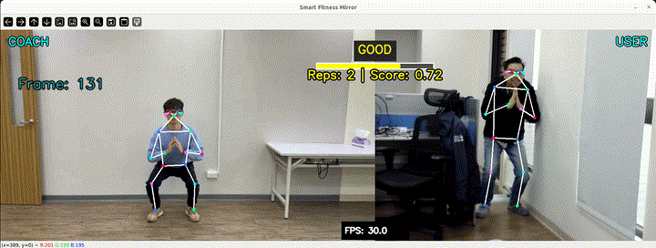

# Fitness Mirror (Pose Comparison & Scoring)


The **Fitness Mirror** application demonstrates a real-time AI coaching system using the pre-trained Yolov8m-pose model on MemryX accelerators. This guide provides setup instructions, model details, and necessary code snippets to help you quickly get started.

Unlike standard pose estimation, this application compares the user's live movements against a pre-recorded "Coach" video using **Dynamic Time Warping (DTW)**. It provides real-time feedback, repetition counting, and similarity scoring.

<p align="center">
  
</p>

## Overview

| Property | Details |
|--------|--------|
| **Model** | [YOLOv8m-Pose](https://docs.ultralytics.com/models/yolov8/) |
| **Model Type** | Pose Estimation |
| **Framework** | [ONNX](https://onnx.ai/) |
| **Model Source** | [Download from Ultralytics GitHub or docs](https://docs.ultralytics.com/models/yolov8/)  |
| **Pre-compiled DFP** |[Download here](https://developer.memryx.com/model_explorer/2p2/YOLO_v8_medium_pose_640_640_3_onnx.zip) |
| **Output** | 17-keypoint human skeleton + similarity score |
| **OS** | Linux |
| **License** | [AGPL-3.0](#license) |

---

## Requirements

Before running the application, ensure that Python, Ultralytics, OpenCV, DTAIDistance, and the required packages are installed. You can install Ultralytics package (for YOLO models), OpenCV and DTAIDistance using the following commands:

```bash
pip install ultralytics==8.3.161 opencv-python==4.11.0.86 dtaidistance==2.3.13
```

> **Note**
> `dtaidistance` includes C extensions.
> If installation fails, ensure a C compiler is installed on your system.

---

## Running the Application (Linux)
All commands below assume you are **inside the project root directory**:

```bash
cd fun_projects/fitness_mirror
```

### Step 1: Download Pre-compiled DFP

To download and unzip the precompiled DFPs, use the following commands:
```bash
wget https://developer.memryx.com/model_explorer/2p2/YOLO_v8_medium_pose_640_640_3_onnx.zip
mkdir -p models
unzip YOLO_v8_medium_pose_640_640_3_onnx.zip -d models
```

<details>
<summary> (Optional) Download and compile the model yourself </summary>
If you prefer, you can download and compile the model rather than using the precompiled model. Download the pre-trained YOLOv8m-pose model and export it to ONNX:

You can use the following code to download the pre-trained yolov8m-pose.pt model and export it to ONNX format:

```bash
from ultralytics import YOLO

# Load a model
model = YOLO("yolov8m-pose.pt")  # load an official model

# Export the model
model.export(format="onnx")
```

You can now use the MemryX Neural Compiler to compile the model and generate the DFP file required by the accelerator:

```bash
mv yolov8m-pose.onnx YOLO_v8_medium_pose_640_640_3_onnx
mx_nc -v -m YOLO_v8_medium_pose_640_640_3_onnx.onnx --autocrop -c 4
```

Output:
The MemryX compiler will generate two files:

* `YOLO_v8_medium_pose_640_640_3_onnx.dfp`: The DFP file for the main section of the model.
* `YOLO_v8_medium_pose_640_640_3_onnx_post.onnx`: The ONNX file for the cropped post-processing section of the model.

Additional Notes:
* `-v`: Enables verbose output, useful for tracking the compilation process.
* `--autocrop`: This option ensures that any unnecessary parts of the ONNX model (such as pre/post-processing not required by the chip) are cropped out.

</details>
---

### Step 2: Run the Script/Program (Analysis Phase)

With the compiled model, you can now run real-time inference. Below are the examples of how to do this using Python.

This application works in two phases:
- **Analysis Phase**: processes a reference coach video and caches pose keypoints
- **Live Phase**: compares the user’s movements against the cached reference data

> **Note:** On the first run, a reference coach video must be processed to generate cache files.
> If no cached data exists, run the application with `--source video` and `--input_video` first.

An example coach video (`assets/coach_example.mp4`) is included in this repository for demonstration purposes.
You may replace it with your own exercise video (e.g., squat, lunge) if desired.

During the first run, the application extracts pose keypoints and caches them.
Once the analysis is complete, the application automatically switches to **Live Phase**.

- When `--source video` is used, the **same video file** is used as the live input (looped playback).
- When `--source cam` is used, the **webcam** is used as the live input.

```bash
cd src/python/
python run_fitness_mirror.py \
  --input_video ../../assets/coach_example.mp4 \
  --source video
```

**Output:**

* `coach_action.npy` — cached pose keypoints
* `coach_action.mp4` — resized reference video

### Step 3: Run Live Phase Using a Webcam (Cache Exists)

If the cached coach files already exist, you can skip the analysis phase and start directly in Live mode using the webcam:

```bash
python src/python/run_fitness_mirror.py --source cam
```

---

### Step 4: Run Live Phase Using a Video File (Optional / Debug)

For testing or debugging without a webcam, you can run Live mode using a video file as the input source:

```bash
python src/python/run_fitness_mirror.py \
  --source video \
  --input_video <path/to/user_test_video.mp4>
```

---
## Tutorial
### Demo Video File

An example coach video (`assets/coach_example.mp4`) is included in this repository
for demonstration purposes.

Users may replace it with their own reference exercise video (e.g., squat, lunge).
Any standard MP4 video with a full-body view is supported.

---

### Key Arguments

The arguments below control the input source and which compiled MemryX models
are loaded at runtime. They are provided to give developers flexibility when
experimenting with different pose models or deployment configurations.

Note that the cached coach data (`*_action.npy`, `*_action.mp4`) is generated
during the analysis phase and is **model-specific**. If the pose model or
keypoint definition changes, the coach cache should be regenerated.

| Argument | Description | Default |
| --- | --- | --- |
| `-d`, `--dfp` | Path to the MemryX DFP file. | `../../models/YOLO_v8...dfp` |
| `-post`, `--post_model` | Path to the Post-Processing ONNX. | `../../models/YOLO_v8...post.onnx` |
| `-i`, `--input_video` | **Required for first run.** Path to the reference coach video. | `None` |
| `--prefix` | Filename prefix for saved cache files (e.g., "squat" -> `squat_action.npy`). | `coach` |
| `-s`, `--source` | Input source. `cam` for webcam, `video` for video input and cache generation. | `cam` |


---

### Understanding the UI

* **Left Panel (COACH):** Loops the reference video.
* **Right Panel (USER):** Shows your live feed with the skeleton overlay.
* **Status Bar:**
* <span style="color:red">**DETECTING...**</span>: The system cannot find your full body. Step back or adjust lighting.
* <span style="color:orange">**MISS**</span>: Movement does not match the coach (wrong timing or form).
* <span style="color:green">**GOOD / PERFECT**</span>: Movement matches well.


* **Score Bar:** Visual representation of the similarity score (0% to 100%).
* **Reps:** Counts valid repetitions automatically using a hysteresis trigger (prevents double counting).


### Quick Tuning Guide

| Problem | Solution |
| --- | --- |
| **Too hard to pass** | Decrease `SCORE_THRESHOLD` OR Decrease `DTW_ALPHA` |
| **Too easy to pass** | Increase `DTW_ALPHA` |
| **Speed mismatch lowers score** | Increase `DTW_WINDOW_EXTRA` |
| **Video Lag / Low FPS** | Increase `EVAL_INTERVAL` |
| **Score feels delayed** | Decrease `EVAL_WINDOW` |


### Configuration Parameters

The application includes several parameters that control scoring sensitivity and performance. These are defined in the `Config` class at the top of the script.

| Parameter | Simple Meaning | Description | Effect of Adjustment |
| --- | --- | --- | --- |
| **SCORE_THRESHOLD** | The Pass Mark | The minimum similarity score required to count a repetition. | **Higher:** Harder to pass.<br>**Lower:** Easier to pass. |
| **DTW_ALPHA** | Strictness Level | Determines how heavily the system penalizes pose errors. | **Higher:** Strict teacher (small errors hurt score a lot).<br>**Lower:** Nice teacher (forgiving of mistakes). |
| **DTW_WINDOW_EXTRA** | Timing Flexibility | Controls the tolerance for speed differences between User and Coach. | **Higher:** Flexible (User can be faster/slower).<br>**Lower:** Strict (User must match Coach's speed). |
| **EVAL_WINDOW** | Observation Length | Number of past frames used to calculate a single score. | **Larger:** Score is smoother, but has more delay (latency).<br>**Smaller:** Score updates instantly, but might be jittery. |
| **EVAL_INTERVAL** | Checking Frequency | How often (in frames) the system runs the heavy math. | **Higher Value (e.g., 5):** Saves CPU, smoother FPS.<br>**Lower Value (e.g., 1):** Checks every frame, high CPU usage. |
| **PERFECT_SCORE** | Gold Medal Standard | The score required to show the "PERFECT" text on screen. | **Higher:** Harder to get the "Perfect" badge.<br>*(Visual only, does not affect rep counting)* |


### Troubleshooting

1. **"dtaidistance" import error:**
Ensure you installed the library: `pip install dtaidistance`.
2. **Low FPS:**
* Ensure the MemryX accelerator is connected properly.
* Increase `EVAL_INTERVAL` or decrease `EVAL_WINDOW` in the `Config` class if the CPU is the bottleneck.


3. **No Skeleton Detected:**
The model requires the full body to be visible. Ensure the camera captures you from head to toe.

## Third-Party Licenses

This project uses third-party software, models, and libraries. Below are the details of the licenses for these dependencies:

- **Model**: [Yolov8M-pose from Ultralytics GitHub](https://docs.ultralytics.com/models/yolov8/) 🔗
  - [AGPLv3](https://github.com/ultralytics/ultralytics/blob/main/LICENSE) 🔗

- **Code and Pre/Post-Processing**: Some code components, including pre/post-processing, were sourced from their [GitHub](https://github.com/ultralytics/ultralytics)
  - [AGPLv3](https://github.com/ultralytics/ultralytics/blob/main/LICENSE) 🔗

* **Media Content**:
  This repository does not include third-party or licensed video content.
  Users must provide their own input videos.

## Summary

This guide offers a quick and easy way to run Fitness Mirror using the yolov8m-pose model on MemryX accelerators. You can use either the Python implementation to perform real-time inference. Download the full code, the pre-compiled DFP file and prepare a full-body view video to get started immediately.