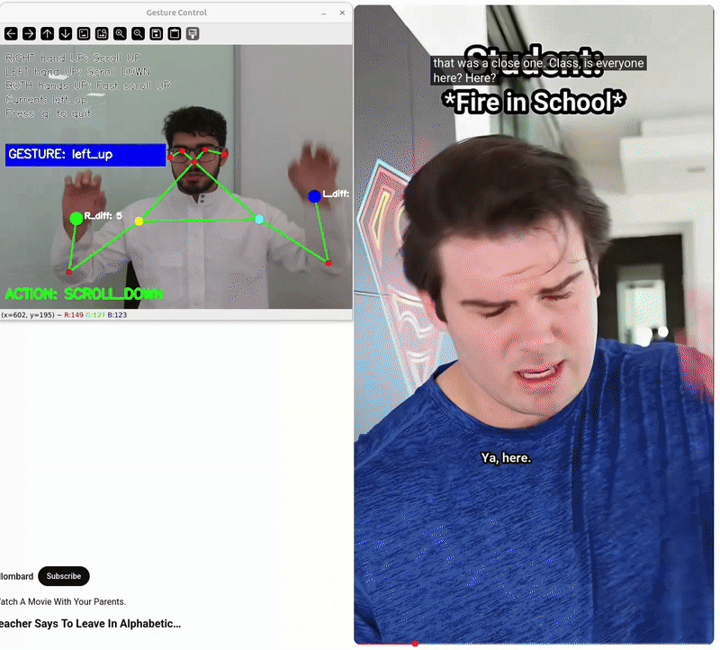

# Gesture Controlled Web Scrolling

This example uses YOLOv8m Pose to control scrolling up and down via body gestures. This guide provides setup instructions, model details, and code snippets to help you quickly get started.

<p align=center>
    
    <p align=center>System in play</p>
</p>


> [!WARNING]
> This example only works on X11 desktops, not Wayland. Run `echo $XDG_SESSION_TYPE` to check your session type.

## Overview

| Property             | Details                                                                 |
|----------------------|-------------------------------------------------------------------------|
| **Model**            | [Yolov8m-pose](https://docs.ultralytics.com/models/yolov8/)                                            |
| **Model Type**       | Pose Estimation                                                        |
| **Framework**        | [ONNX](https://onnx.ai/)                                                   |
| **Model Source**     | [Download from Ultralytics GitHub or docs](https://docs.ultralytics.com/models/yolov8/) |
| **Pre-compiled DFP** | [Download here](https://developer.memryx.com/model_explorer/2p2/YOLO_v8_medium_pose_640_640_3_onnx.zip)                                          |
| **Model Resolution** | 640x640                                                       |
| **Output**           | Person bounding boxes and pose landmark coordinates |
| **OS**               | Linux |
| **License**          | [AGPL](LICENSE.md)                                       |

## Environment Setup

Before running the application, ensure that the [MemryX SDK](https://developer.memryx.com/get_started/install_tools.html) is installed, and then install the following required packages:

```bash
pip install "opencv-python~=4.11.0" pyautogui
```

## Running the Application

### Step 1: Download Pre-compiled DFP

To download and unzip the precompiled DFPs, use the following commands:
```bash
wget https://developer.memryx.com/model_explorer/2p2/YOLO_v8_medium_pose_640_640_3_onnx.zip
mkdir -p models
unzip YOLO_v8_medium_pose_640_640_3_onnx.zip -d models
```

<details> 
<summary> (Optional) Download and compile the model yourself </summary>
If you prefer, you can download and compile the model rather than using the precompiled model. Download the pre-trained YOLOv8m-pose model and export it to ONNX:

You can use the following code to download the pre-trained yolov8m-pose.pt model and export it to ONNX format:

```bash
from ultralytics import YOLO

# Load a model
model = YOLO("yolov8m-pose.pt")  # load an official model

# Export the model
model.export(format="onnx")
```

You can now use the MemryX Neural Compiler to compile the model and generate the DFP file required by the accelerator:

```bash
mx_nc -v -m yolov8m-pose.onnx --autocrop -c 4
```

Output:
The MemryX compiler will generate two files:

* `yolov8m-pose.dfp`: The DFP file for the main section of the model.
* `yolov8m-pose_post.onnx`: The ONNX file for the cropped post-processing section of the model.

Additional Notes:
* `-v`: Enables verbose output, useful for tracking the compilation process.
* `--autocrop`: This option ensures that any unnecessary parts of the ONNX model (such as pre/post-processing not required by the chip) are cropped out.
* For best deployment FPS, add `--effort hard` and `-j $(nproc)` to use [effort=hard mode](https://developer.memryx.com/tools/neural_compiler.html#mapping-arguments).

</details>

### Step 2: Run the Application

With the compiled model, you can now run the application

Simply execute the following command:

```bash
cd src/python
python gesture_web_control.py
```

## Third-Party Licenses

This project uses third-party software, models, and libraries. Below are the details of the licenses for these dependencies:

- **Model**: [Yolov8M-pose from Ultralytics GitHub](https://docs.ultralytics.com/models/yolov8/) 🔗 
  - [AGPLv3](https://github.com/ultralytics/ultralytics/blob/main/LICENSE) 🔗

