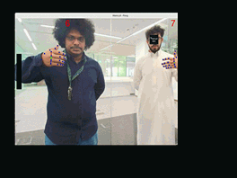

# Pong Game Using Mediapipe Palm Detection 🏓

Classic game of pong using computer vision to detect hand movements and link it to the games player paddles. Using the mediapipe model, it can detect and diffrentiate between left hand and right hand, and assigns player 1 and player 2 to it, respectevly. The game also keeps players scores and display it on the screen.

<p align="center">
  
</p>

## Overview

| **Property**         | **Details**                                                                                  
|----------------------|------------------------------------------
| **Model**            | [MediaPipe Palm detection model](https://mediapipe.readthedocs.io/en/latest/solutions/hands.html#palm-detection-model)🔗, [MediaPipe Hand Landmark model](https://mediapipe.readthedocs.io/en/latest/solutions/hands.html#hand-landmark-model)🔗
| **Model Type**       | Palm Detection & Hand Landmark Models
| **Framework**        | TFLite
| **Model Source**     | [Palm Detection (Full)](https://storage.googleapis.com/mediapipe-assets/palm_detection_full.tflite)🔗⬇️ ,  [Hand Landmark (Full)](https://storage.googleapis.com/mediapipe-assets/hand_landmark_full.tflite)🔗⬇️ from the [google-edge-ai/mediapipe repository](https://github.com/google-ai-edge/mediapipe/blob/master/docs/solutions/models.md#hands)🔗
| **Pre-compiled DFP** | [Download here](https://developer.memryx.com/example_files/2p0/mediapipe_hands.zip)
| **Input**            | Input size for Palm Detection Model: (192,192,3), Input size for Hand Landmark model : (224,224,3)
| **Output**           | Output from HandLandmark model: bounding boxes, landmarks, rotated landmarks, handedness, confidence 
| **License**          | [MIT License](LICENSE.md)


## Requirements

### Linux

Before running the application, ensure that **OpenCV** and all other dependencies is installed

You can install dependencies using the following command:

```bash
pip3 install opencv-python==4.11.0.86 pygame==2.6.1 numpy==1.26.4
```

<!-- Windows Section is commented and unmodified until program is fully tested on windows -->

<!-- ### Windows -->

<!-- On Windows, first make sure you have installed [Python 3.11](https://apps.microsoft.com/detail/9nrwmjp3717k)🔗 -->

<!-- Then open the `src/python_windows/` folder and double-click on `setup_env.bat`. The script will install all requirements automatically. -->


## Running the Application (Linux)

### Step 1: Download or Compile DFP

#### Linux

To download and unzip the precompiled DFPs, use the following commands:

```bash
mkdir models && cd models
wget https://developer.memryx.com/example_files/2p0/mediapipe_hands.zip
unzip mediapipe_hands.zip
```

<details>
<summary> (Optional) Download and Compile the Model Yourself </summary>

If you prefer, you can download and compile the model rather than using the precompiled model. Download the pre-trained 

* Palm Detection and HandLandmark models from from the [google-edge-ai/mediapipe repository](https://github.com/google-ai-edge/mediapipe/blob/master/docs/solutions/models.md#hands)🔗

```bash
wget https://storage.googleapis.com/mediapipe-assets/palm_detection_full.tflite
wget https://storage.googleapis.com/mediapipe-assets/hand_landmark_full.tflite
```

You can now use the MemryX Neural Compiler to compile the model and generate the DFP file required by the accelerator:

```bash
mx_nc -m hand_landmark_full.tflite palm_detection_full.tflite --autocrop
```

**NOTE:** if you compile the DFP yourself, the NeuralCompiler will create a cropped post-processing model. This model is just simple data organziation operations, so our `MxHandPose.py` actually forgoes use of the `post.tflite` and uses plain numpy functions. Thus it is safe to delete the post model file.

</details>


<!-- #### Windows

[Download](https://developer.memryx.com/example_files/2p0/mediapipe_hands.zip) and open the zip, and place the .dfp file in the `models/` folder. -->


<!-- Note: The windows instructions are ommited until fully tested on windows -->
---

Your folder structure should now be:
```
|- README.md
|- LICENSE.md
|- models/
|  |- models.dfp
|- assets/
|  |- mx3.png
|  |- PONG_GAME.gif
|- src/
|  |- python/
|      |- mp_handpose.py
|      |- mp_palmdet.py
|      |- MxHandPose.py
|      |- runGame.py 
```


### Step 2: Run the Program

#### Linux

To run on Linux, make sure your python env is activated and simply execute the following commands:

```bash
cd src/python/
python runGame.py
```
 
Press 'x' button on the window to quit the program!
<!-- 
#### Windows

On Windows, you can just **double-click the `run_windows.bat` file** instead of invoking the python interpreter on the command line. -->


## Third-Party Licenses

*This project utilizes third-party software and libraries. The licenses for these dependencies are outlined below:*

- **Models**: [MediaPipe Palm detection model and MediaPipe Hand Landmark model from google-ai-edge/mediapipe repository](https://github.com/google-ai-edge/mediapipe/blob/master/docs/solutions/models.md#hands)🔗
    - License : [Apache 2.0 License](https://github.com/google-ai-edge/mediapipe/blob/master/LICENSE) 🔗
- **Code Reuse**: Preprocessing and postprocessing code was used from the [opencv repository](https://github.com/opencv/opencv_zoo/tree/main/models/handpose_estimation_mediapipe)🔗
    - License : [Apache 2.0 License](https://github.com/opencv/opencv_zoo/blob/main/models/handpose_estimation_mediapipe/LICENSE)🔗
