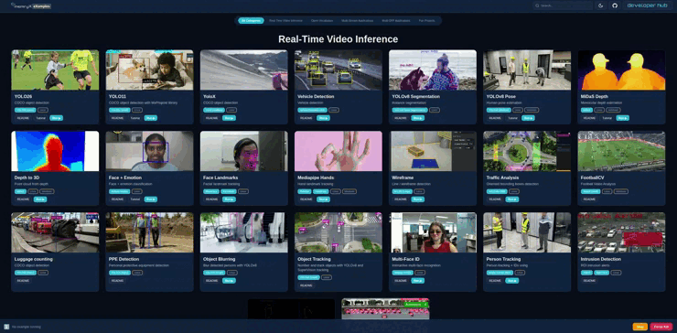

# MemryX Examples Launcher

<picture>
  
</picture>

A clean control panel for the MemryX examples repo.

Instead of jumping across folders and README files, you launch one app and:
- Discover examples by category
- Open docs/tutorials fast
- Start supported demos from one place
- Watch live logs in real time

## Start Here

If this is your first run, use this path.

### Local install
```bash
python3 -m venv .venv
source .venv/bin/activate
pip install --extra-index-url https://developer.memryx.com/pip -e ".[memryx-sdk]"
example_launcher
```
### Github install
```bash
python3 -m venv .venv
source .venv/bin/activate
pip install --extra-index-url https://developer.memryx.com/pip -e "git+ssh://git@github.com/memryx/memryx_examples_internal.git@gui_app#egg=memryx-examples-launcher[memryx-sdk]"
example_launcher
```

The launcher auto-opens `http://localhost:8080` in your browser.


## Workflow

1. Activate env: `source .venv/bin/activate`
2. Start launcher: `example_launcher`
3. Pick an example in the browser and click **Run**
4. Stop launcher with `Ctrl+C`


### Example fails after clicking Run

The launcher starts examples, but each example can still require its own models, assets, and environment setup. Check that example’s README for exact prerequisites.
