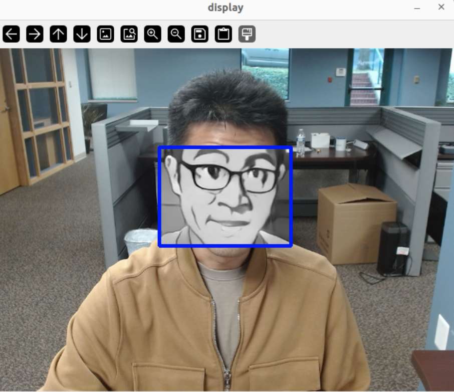

# Multi-DFP Example with Conditional Pipeline

This example demonstrates how two distinct DFPs(Data Flow Pipelines) — Cartoonizer and Face Detection — can be combined and run as a single application using a condition pipeline on MemryX accelerators. The face detector runs first; then **if** faces are found, the cartoonizer is applied to each cropped face and displayed. Otherwise, the raw frame is displayed. It uses a pre-trained `face_detection_short_range.tflite` model and an open-source cartoonizer model for real-time inference.

While [Cartoonizer](../../fun_projects/cartoonizer/README.md) and [Face detection](../../video_inference/face_emotion_detection/README.md) are available as separate examples for single-application use, this demo highlights how multiple pipelines can run together efficiently with conditional logic. Refer to the individual examples for single-DFP usage.

<p align="center">
  

</p>

## Overview

| Property             | Details                                                                 |
|----------------------|-------------------------------------------------------------------------|
| **Model Type**       | Cartoonizer and Face Detection                                                        |
| **Framework**        | [onnx](https://onnx.ai/),[ tflite](https://www.tensorflow.org/)                                        |
| **Model Source**    | [FacialCartoonization](https://github.com/SystemErrorWang/FacialCartoonization) and [Face Detection](https://github.com/patlevin/face-detection-tflite) |
| **Pre-compiled DFP** | [Download here]((https://developer.memryx.com/example_files/2p2/nightmare_vision.zip))        |
| **Face Detector Model Resolution** | 128x128                                                       |
| **Cartoonizer Model Resolution** | 512x512                         
| **Output**           | cartoonized faces and corresponding bounding boxes|
| **OS**               | Linux |
| **License**          | [AGPL](LICENSE.md)                                       |

## Requirements (Linux)

Before running the application, ensure that Python, OpenCV, and the required packages are installed. You can install required packages using the following commands:

```bash
pip install opencv-python==4.11.0.86
```


## Running the Application (Linux)

### Step 1: Download Pre-compiled DFP

To download and unzip the precompiled DFPs, use the following commands:
```bash
mkdir -p models
cd models

# Download and extract the two pre-compiled DFP files
wget https://developer.memryx.com/example_files/2p2/nightmare_vision.zip
unzip -j nightmare_vision.zip

cd ..
```

<details> 

<summary> (Optional) Download and compile the model yourself </summary>

##### 1a - Download FacialCartoonization Model

Download the pretrained model weights (weight.pth) from the **FacialCartoonization** GitHub repository

```bash
wget https://github.com/SystemErrorWang/FacialCartoonization/blob/master/weight.pth
```

Export the model to ONNX format. To help with the export process, you can refer to the generate_onnx.py script available in the zip folder, which shows you how to convert the model to ONNX format. See also the .

You can now use the MemryX Neural Compiler to compile the model and generate the DFP file required by the accelerator:

```bash
mx_nc -v -m facial-cartoonizer_512.onnx --autocrop -c 4
```

Output:
The MemryX compiler will generate dfp file:

* `facial-cartoonizer_512.dfp`: The DFP file for the main section of the model.

Additional Notes:
* `-v`: Enables verbose output, useful for tracking the compilation process.
* `--autocrop`: This option ensures that any unnecessary parts of the ONNX model (such as pre/post-processing not required by the chip) are cropped out.

##### 1b - Download Face Detector model

You can use the following code to download the pre-trained face_detection_short_range.tflite model

```bash
wget https://github.com/patlevin/face-detection-tflite/raw/main/fdlite/data/face_detection_short_range.tflite
```

You can now use the MemryX Neural Compiler to compile the model and generate the DFP file required by the accelerator:

```bash
mx_nc -v -m face_detection_short_range.tflite --autocrop -c 4 --dfp_fname face_detector
```

Output:
The MemryX compiler will generate DFP file:

* `face_detector.dfp`: The DFP file for the main section of the model.

Additional Notes:
* `-v`: Enables verbose output, useful for tracking the compilation process.
* `--autocrop`: This option ensures that any unnecessary parts of the ONNX model (such as pre/post-processing not required by the chip) are cropped out.
* `--dfp_name`: file path location to save dataflow program (defaults to './{model_name}.dfp'

</details>

### Step 2: Run the Script/Program

With the compiled model, you can now run real-time inference. Below are the examples of how to do this using Python and C++.

#### Python

To run the Python example using MX3, follow these steps:

Simply execute with camera by the following command:

```bash
cd src/python/
python run.py
```

Run it with a video:

```bash
python run.py --video <video_path>
```

Command-line Options:
You can specify the model path and DFP (Compiled Model) path using the following options:

* `--dfp_cartoon`:  Path to the compiled DFP file of Cartoonizer (default is ../../models/cartoonizer.dfp)
* `--dfp_face`:  Path to the compiled DFP file of Face Detector (default is ../../models/face_det.dfp)

Example:
To run with a specific model and DFP file, use:

```bash
python run.py [--video <video_path>] [--dfp_cartoon <cartoon_dfp_path>] [--dfp_face <face_dfp_path>]
```

If no arguments are provided, the script will use the default paths for the model and DFP.


## Third-Party Licenses

This project uses third-party software, models, and libraries. Below are the details of the licenses for these dependencies:

- **Model**: [From from GitHub](hhttps://github.com/SystemErrorWang/FacialCartoonization) 🔗 
  - License: [CC BY-NC-SA 4.0](https://creativecommons.org/licenses/by-nc-sa/4.0/legalcode) 🔗

- **Model 1**: [face_detection_short_range.tflite](https://github.com/patlevin/face-detection-tflite/) 🔗 
  - License: [MIT](https://github.com/patlevin/face-detection-tflite/blob/main/LICENSE) 🔗
