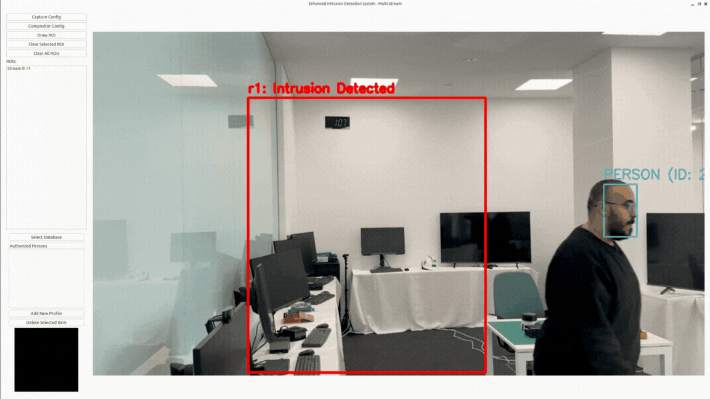

# Multistreamed Intrusion Detection System

<p align="center">
  
</p>

The **Multistreamed Intrusion Detection System** demonstrates **multistreamed real-time person detection and recogntion** using the **MultiStreamAsyncAccl API and Multi-Model DFP compilation** on the MemryX accelerators:

1. Allows users to define ROI (Region of Interest) interactively via GUI
2. Pre-labels and saves "AUTHORIZED" faces using face recognition
3. Labels faces as "AUTHORIZED" in real-time
4. Detects unauthorized faces in ROI and raises alerts with face capture

## Overview

| **Property**         | **Details**                                                                 
|----------------------|-------------------------------------------------------------------------
| **Models**           | [YoloV8n-Face](https://github.com/derronqi/yolov8-face) + [FaceNet](https://arxiv.org/pdf/1503.03832) (Face Detection and Recognition)
| **Model Type**       | Face Detection + Face Recognition
| **Framework**        | [Onnx](https://onnx.ai/)
| **Pre-compiled DFP** | [Download here](https://developer.memryx.com/example_files/2p2/face_recognition.zip) (Face Recognition)
| **Input**            | Video stream (camera or file)
| **Output**           | Face bounding boxes, authorization status, intrusion alerts
| **OS**               | Linux
| **License**          | [GPL](LICENSE.md)

## Requirements

Before running the application, ensure that all **requirements** are installed.

```bash
pip3 install -r requirements.txt
```

## Model Setup

### Step 1: Download Pre-compiled DFPs

This system requires models for face detection and recognition. Download and extract them directly into this project's `models/` directory:

**Face Recognition Models (YOLOv8n-face + FaceNet):**
```bash
wget https://developer.memryx.com/example_files/2p2/face_recognition.zip
mkdir -p models
unzip face_recognition.zip -d models
```

After extraction, your `models/` directory should contain:
- `yolov8n_facenet.dfp` - Face detection and recognition model
- `yolov8n-face_post.onnx` - Face recognition post-processing model

<details>
<summary> (Optional) Download and compile the model yourself </summary>

If you prefer to compile the models yourself, you'll need the source ONNX files for FaceNet and YOLOv8n-face. Once you have the ONNX files, you can compile them using the following Python script:

```bash
wget https://developer.memryx.com/example_files/face_recognition_original.zip
unzip face_recognition_original.zip -d models
```
You can now use the MemryX Neural Compiler to compile the models and generate the DFP file required by the accelerator:
```bash
cd models/ 
mx_nc -v -m Facenet.h5 yolov8n-face_crop.onnx --dfp_fname yolov8n_facenet.dfp 
```
</details>

### Step 2: Run the Viewer

Move to the `src/` directory and run the application:

**Default (Single Stream):**
```bash
cd src/
python demo.py
```
This will use `/dev/video0` by default. If `/dev/video0` is not found or cannot be opened, the program will exit with error "Video Source not Found".

**Multiple Streams:**
```bash
cd src/
python demo.py --video_paths /dev/video0 /dev/video2
```

You can specify different video sources:
- Cameras: `/dev/video0`, `/dev/video1`, etc.
- Video files: `--video_paths path/to/video1.mp4 path/to/video2.mp4`
- Mixed: `--video_paths /dev/video0 path/to/video.mp4`

**Note:** If `--video_paths` is not specified, the system defaults to `/dev/video0`. All video sources are validated before use - invalid sources are skipped, and if no valid sources remain, the program exits with an error.

## Viewer Details

**Multi-Stream Display:**
- All video streams are displayed in a grid layout
- Each stream is shown in its own cell
- The grid automatically adjusts based on the number of streams

**Define ROI (Per Stream):**
1. Click "Draw ROI" button
2. Click and drag on any stream's video to define the region of interest
3. Release to set the ROI (automatically associated with that stream)
4. Each stream can have its own independent ROIs
5. ROIs are displayed in the list as "Stream {N}: {ROI name}"

**Authorize Faces (Centralized):**
1. Click on a face in any stream's video to authorize them
2. Enter a name for the authorized person
3. The system will save their face and mark them as authorized
4. **Note:** The authorization database is shared across all streams - a face authorized in one stream will be recognized in all streams

**View Authorized Faces:**
- Use the database viewer on the left panel to view and manage authorized persons
- Click on profiles to see associated face images
- The database is shared across all streams

**Intrusion Detection (Per Stream):**
- The system automatically detects unauthorized faces in each stream's ROIs
- When an intrusion is detected in a stream:
  - An alert is displayed only on that stream's video
  - The ROI turns red only on that stream
  - The intruder's face is captured and saved to `assets/intrusions/` with stream index in filename

## Third-Party Licenses

This project uses third-party software, models, and libraries:

- **Yolov8n-face Model**: [Yolov8-Face](https://github.com/derronqi/yolov8-face) - [GNU General Public License v3.0](https://github.com/derronqi/yolov8-face/blob/main/LICENSE)
- **FaceNet Model**: [DeepFace](https://github.com/serengil/deepface) - [MIT License](https://github.com/serengil/deepface/blob/master/LICENSE)
- **ByteTrack**: [ByteTrack](https://github.com/ifzhang/ByteTrack) - [MIT](https://github.com/ifzhang/ByteTrack)

## Summary

This system integrates face detection, face recognition, and intrusion detection into a comprehensive multi-stream security application with an intuitive GUI interface. The system uses face-only detection to identify and track individuals across multiple video streams simultaneously, eliminating the need for separate person detection models. Each stream operates independently with its own ROIs and alerts, while sharing a centralized authorization database.

