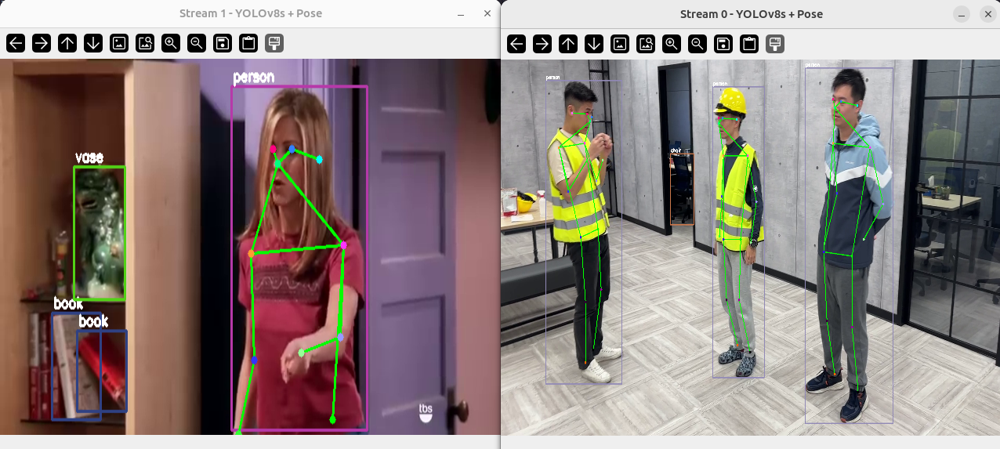

# Object Detection and Pose Estimation in Parallel in 1 DFP

The **Object Detection** & **Pose Estimation** multi-stream example showcases the use of multiple models, YOLOv8n and YOLOv8n-pose, running fully in parallel by [compiling them together](https://developer.memryx.com/tools/neural_compiler.html#multi-model) in 1 DFP. This guide provides setup instructions, model details, and necessary code snippets to help you get started quickly.


<p align="center">
  
</p>


## Overview

| Property             | Details                                                                 |
|----------------------|-------------------------------------------------------------------------|
| **Model**            | [Yolov8n](https://docs.ultralytics.com/models/yolov8/) and [Yolov8n Pose](https://docs.ultralytics.com/models/yolov8/)                                          |
| **Model Type**       | Object Detection  and Pose EStimation                                                    |
| **Framework**        | [onnx](https://onnx.ai/)                                                   |
| **Model Source**     | [Download from Ultralytics GitHub or docs](https://docs.ultralytics.com/models/yolov8/) and export to onnx |
| **Pre-compiled DFP** | [Download here](https://developer.memryx.com/example_files/2p0/objectDet_poseEst_yolov8.zip)   |
| **Model Resolution** | 640x640                                            |
| **Output**           | Bounding box coordinates with objectness score, class probabilities and Person bounding boxes and pose landmark coordinates|
| **OS**               | Linux |
| **License**          | [AGPL](LICENSE.md)                                       |

## Requirements

Before running the application, ensure that Python, OpenCV, and the required packages are installed. You can install OpenCV and the Ultralytics package (for exporting YOLO models) using the following commands:

```bash
# For application
pip install opencv-python==4.11.0.86
```

```bash
# For exporting source model to onnx
pip install pyyaml==6.0.2
pip install pandas==2.3.1
pip install ultralytics==8.3.161
```

## Running the Application

### Step 1: Download Pre-compiled DFP

To download and unzip the precompiled DFPs, use the following commands: (Both tflite and ONNX is supported)
```bash
mkdir -p models
cd models
wget https://developer.memryx.com/example_files/2p0/objectDet_poseEst_yolov8.zip
unzip -j objectDet_poseEst_yolov8.zip
mv objectDet_poseEst_yolov8/* ./
```

<details> 
<summary> (Optional) Download and compile the model yourself </summary>
If you prefer, you can download and compile the model rather than using the precompiled model. Download the pre-trained model and export it ONNX:

You can use the following code to download the pre-trained yolov8n.pt model and export it to ONNX:

Yolov8n Object Detection:
```bash
from ultralytics import YOLO

# Load a model
model = YOLO("yolov8n.pt")  # load an official model

# Export the model
# ONNX format
model.export(format="onnx")
```

Yolov8n-pose Pose Estimation:

You can use the following code to download the pre-trained yolov8n-pose.pt model and export it to ONNX format:

```bash
from ultralytics import YOLO

# Load a model
model = YOLO("yolov8n-pose.pt")  # load an official model

# Export the model
model.export(format="onnx")
```

You can now use the MemryX Neural Compiler to compile the model and generate the DFP file required by the accelerator:

```bash
 mx_nc -m yolov8n.onnx yolov8n-pose.onnx -v --autocrop -c 4
```
The compiler will generate the DFP file(models.dfp) and a post-processing file, which can then be used as inputs to the application

</details>


### Step 2: Run the Script/Program

With the compiled model, you can now run real-time inference. 

#### Python

To run the Python example for object detection and pose estimation with yolov8n and yolov8n-pose model using MX3, simply execute the following command:

```bash
# ensure a camera device is connected as default video input is a cam
cd src/python/
python run_yolov8_objdet_pose.py
```
You can specify the model path and the DFP (Compiled Model) path using the following options. 

* `-p` or `--postmodel`: Path to the model file (default is models/model_1_yolov8n-pose_post.onnx) (Only the pose model requires a post model to be provided.)
* `-d` or `--dfp`: Path to the compiled DFP file (default is models/models.dfp)

You can specify the input video path with the following option:

* `--video_paths` : Paths to video files as inputs (default is /dev/video0, camera connected to the system)

For example, to run with a specific video, post-processing model and DFP file, use:

```bash
python run_yolov8_objdet_pose.py -p <postmodel_path> -d <dfp_path> --video_paths /dev/video0
```

You can specify multiple input video paths to run multiple stream with `--video_paths` option:

```bash
python run_yolov8_objdet_pose.py --video_paths /dev/video0 <video_path1> <video_path2>
```

If no arguments are provided, the script will use the default post-processing model and DFP paths.


## Third-Party License

This project uses third-party software, models, and libraries. Below are the details of the licenses for these dependencies:

- **Model**: [Yolov8 from Ultralytics GitHub](https://docs.ultralytics.com/models/yolov8/) 🔗 
  - License: [AGPL](https://github.com/ultralytics/ultralytics/blob/main/LICENSE)  🔗

- **Code and Pre/Post-Processing**: Some code components, including pre/post-processing, were sourced from their [GitHub](https://github.com/ultralytics/ultralytics)  
  - License: [AGPL](https://github.com/ultralytics/ultralytics/blob/main/LICENSE)  🔗

## Summary

This guide offers a quick and easy way to run multi-stream object detection and pose estimation compiled into a single DFP using the YOLOv8n and YOLOv8n-Pose models on MemryX accelerators. You can use the Python implementation to perform real-time inference. Download the full code and the precompiled DFP file to get started immediately.
