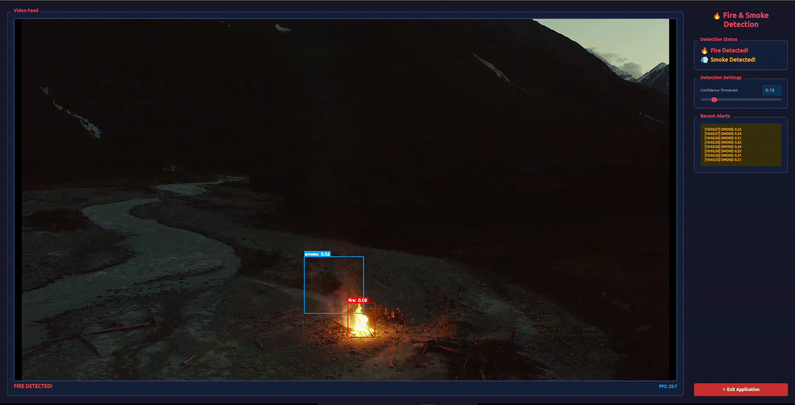

# Fire and Smoke Detection Example Application

The **Fire and Smoke Detection** example demonstrates real-time fire and smoke detection using a YOLOv8s model on MemryX accelerators. This application features a detection alerts and adjustable settings. This guide provides setup instructions, model details, and code snippets to help you quickly get started.

<p align="center">
  
</p>

## Overview

| **Property**         | **Details**                                                                                  
|----------------------|------------------------------------------
| **Model**            | [YOLOv8 small](https://docs.ultralytics.com/models/yolov8/)
| **Model Type**       | Object Detection
| **Framework**        | [ONNX](https://onnx.ai/) 
| **Pre-compiled DFP** | [Download here](https://developer.memryx.com/example_files/2p0/fire_smoke_detection_v8s.zip)
| **Dataset**          | [*Smoke-Fire-Detection-YOLO*. Kaggle](https://www.kaggle.com/datasets/sayedgamal99/smoke-fire-detection-yolo) 
| **Model Resolution** | 640x640 
| **Output**           | Fire and smoke bounding boxes with confidence scores
| **OS**               | Linux
| **License**          | [AGPL-3.0](#third-party-licenses)


## Requirements

Before running the application, ensure that Python, OpenCV, and the required packages are installed:

```bash
pip install opencv-python==4.11.0.86
pip install PyQt6
```

For MemryX SDK installation, please refer to [MemryX Developer Hub](https://developer.memryx.com/get_started/install_runtime.html).

## Running the Application
#### Linux
### Step 1: Download Pre-compiled DFP
```bash
mkdir -p models
cd models

wget https://developer.memryx.com/example_files/2p0/fire_smoke_detection_v8s.zip
unzip fire_smoke_detection_v8s.zip

rm fire_smoke_detection_v8s.zip
cd ..
```
<details> 
<summary> (Optional) Download and compile the model yourself </summary>

First create the models folder using the steps below.

```bash
mkdir models -p
cd models
```

You can download the pre-trained YOLOv8s model using the following commands:

```bash
wget https://developer.memryx.com/example_files/2p0/fire_smoke_detection_v8s_onnx.zip
unzip fire_smoke_detection_v8s_onnx.zip
rm fire_smoke_detection_v8s_onnx.zip
```

You can use the MemryX Neural Compiler to compile the model and generate the DFP file required by the accelerator. If you prefer, you can download the pre-compiled DFP and skip this step.

```bash
mx_nc -m fire_smoke_detection_v8s_onnx.onnx --autocrop
```

</details>


### Step 2: Run the Application

The application can be run using:

**Quick Start (GUI mode):**
```bash
cd src/python
python run.py
```

**With webcam:**
```bash
cd src/python
python run.py --video_path /dev/video*
```

**With video file:**
```bash
cd src/python
python run.py --video_path [File_Path]
```


#### Command-Line Arguments

The app supports the following command-line arguments:

- `-d` or `--dfp`: Path to the compiled DFP file (default: `../../models/newfire11n.dfp`)
- `-m` or `--postmodel`: Path to the post-processing ONNX file (default: `../../models/newfire11n_post.onnx`)
- `--video_path`: Path to video file or `cam` for webcam (default: `../../assets/test0.mp4`)
- `--nms`: NMS/IoU threshold for filtering overlapping boxes (default: `0.45`)
- `--display_size`: Display window size as WIDTHxHEIGHT (e.g., `1920x1080`)

## Third-Party Licenses

*This project utilizes third-party videos and data sources. The licenses for these dependencies are outlined below:*

- **Model**: [YOLOv8s-Detection from Ultralytics](https://docs.ultralytics.com/models/yolov8/), Copyright (c) Ultralytics, 
  - [AGPL-3.0 License](https://github.com/ultralytics/ultralytics/blob/main/LICENSE) 🔗

- **Code and Pre/Post-Processing**: Some code components, including pre/post-processing, were sourced from [Ultralytics GitHub](https://github.com/ultralytics/ultralytics),
  - [AGPL-3.0 License](https://github.com/ultralytics/ultralytics/blob/main/LICENSE) 🔗

- **Dataset**: [Smoke & Fire Detection YOLO Dataset](https://www.kaggle.com/datasets/sayedgamal99/smoke-fire-detection-yolo) from Kaggle
   - [License](https://creativecommons.org/publicdomain/zero/1.0/) 🔗
- **Video 1**: [Mountains Summer Travel Camping](https://www.pexels.com/video/mountains-summer-travel-camping-4125031/) from Pexels
   - [License](https://www.pexels.com/license/) 🔗
- **Video 2**: [Wildfire Near The Houses](https://www.pexels.com/video/wildfire-near-the-houses-15184525/) from Pexels
   - [License](https://www.pexels.com/license/) 🔗

## Summary

This guide provides a comprehensive overview of the Fire and Smoke Detection system using MemryX accelerators. The system processes video streams in real-time, detecting fire and smoke with high accuracy and performance. live video monitoring with detection alerts, adjustable confidence thresholds, and real-time statistics. Download the pre-compiled DFP file and follow the setup instructions to get started with real-time fire and smoke detection monitoring.
