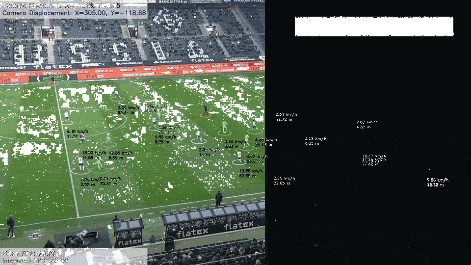

# FootballCV Example Application

The **FootballCV** example demonstrates real-time football/soccer video analysis using the pre-trained YOLOv8 small model on MemryX accelerators. 

<p align="center">
  
</p>

## Overview

| **Property**         | **Details**                                                                                  
|----------------------|------------------------------------------
| **Data Source**      | [*Football Players Detection Dataset*. Roboflow Universe, 2025.](https://universe.roboflow.com/roboflow-jvuqo/football-players-detection-3zvbc) 
| **Model**            | [YOLOv8s-detection](https://docs.ultralytics.com/models/yolov8/) 
| **Model Type**       | Object Detection
| **Framework**        | [ONNX](https://onnx.ai/) 
| **Model Source**     | [Download from Ultralytics GitHub or docs](https://docs.ultralytics.com/models/yolov8/)
| **Pre-compiled DFP** | [Download here](https://developer.memryx.com/example_files/2p0/footballcv_v8s_640_640_3.zip)
| **Input**            | 640x640 (default)
| **Output**           | video with annotations and information (matches original video size)
| **License**          | [AGPL](LICENSE.md)

## Requirements

Before running the application, ensure that MemryX hardware and software are installed. [MemryX SDK Get Started Guide](https://developer.memryx.com/get_started/index.html)

Also, ensure the following dependencies are installed.

```bash
pip install PyQt5==5.15.11
```

```bash
pip install opencv-python==4.11.0.86
```


## Running the Application

### Step 1: Download Pre-compiled DFP

To download and unzip the pre-compiled DFPs, use the following commands:
```bash
mkdir -p models
cd models

wget https://developer.memryx.com/example_files/2p0/footballcv_v8s_640_640_3.zip
unzip footballcv_v8s_640_640_3.zip

rm footballcv_v8s_640_640_3.zip
cd ..
```

<details> 
<summary> (Optional) Download and compile the model yourself </summary>

First create the models folder using the steps below.

```bash
mkdir models -p
cd models
```

You can download the pre-trained YOLOv8s model using the following commands:

```bash
wget https://developer.memryx.com/example_files/2p0/footballcv_v8s_640_640_3_model_onnx.zip
unzip footballcv_v8s_640_640_3_model_onnx.zip
rm footballcv_v8s_640_640_3_model_onnx.zip
```

You can use the MemryX Neural Compiler to compile the model and generate the DFP file required by the accelerator. If you prefer, you can download the pre-compiled DFP and skip this step.

```bash
mx_nc -m footballcv_v8s_640_640_3.onnx --autocrop
```

</details>

### Step 2: Running the Script/Program

With the compiled model, you can now run real-time inference. Below are the examples of how to do this using Python.

#### Python

To run the Python example using MX3, follow these steps:

Simply execute the following command:

```bash
cd src/
python main.py
```
Run it with a video:

```bash
python main.py --video <video_path>
```

To save the results, use:
```bash
python main.py --video <video_path> --save
```

Command-line Options:
You can specify the model path and DFP (Compiled Model) path using the following options:

* `--dfp`:  Path to the compiled DFP file of detection model (default is models/footballcv_yolov8s.dfp)
* `--post`: Path to the post-processing ONNX file generated after compilation (default is  models/footballcv_yolov8s_post.onnx)
* `--video`:  Path to the input video file (default is assets/video.mp4)
* `--output`:  Path to the output video file (default is output/result.mp4 or output/result_#n.mp4)
* `--display_queue`: Max frames buffered for display to help avoiding unbounded RAM. (default is 300)
* `--save`: Save annotated output video. (default: disabled)

Example:
To run with a specific model, DFP file, input video, save flag, and output video path, use:

```bash
python main.py --video <video_path> --dfp <dfp_path> --post <pose_post_processing_onnx_path> --output <ouptput_video_path> --save
```

If no arguments are provided, the script will use the default paths for the model and DFP.


## Third-Party Licenses

This project uses third-party software, models, and libraries. Below are the details of the licenses for these dependencies:

- **Model**: [YOLOv8s-detect from Ultralytics GitHub](https://docs.ultralytics.com/models/yolov8/) 🔗 
  - [AGPLv3](https://github.com/ultralytics/ultralytics/blob/main/LICENSE) 🔗
    
- **Dataset**: [Roboflow](https://universe.roboflow.com/roboflow-jvuqo/football-players-detection-3zvbc)  
  - [© 2025 Roboflow, Inc.](https://creativecommons.org/licenses/by/4.0/deed.en) 🔗

## Credits & Attribution

This project incorporates ideas, logic, and selected implementations adapted from the following sources:

- **Football Analysis Repository**
  - Repository: https://github.com/abdullahtarek/football_analysis
  - Author: Abdullah Tarek
  - License: MIT
  - Usage: Most of drawing functions and idea of the whole project.

- **YouTube Tutorial**
  - Video: https://www.youtube.com/watch?v=neBZ6huolkg
  - Creator: Abdullah Tarek
  - Usage: High-level pipeline design and football analytics methodology inspired parts of the implementation.

## Summary

The **FootballCV** application is a real-time sport analytics pipeline optimized for MemryX accelerators. It transforms raw match footage into actionable tactical data by combining object detection with spatial mapping.

### Key Features

The application processes video input to output an annotated stream featuring:

* **Detection & Tracking:** Identifies players, referees, and the ball using YOLOv8s.
* **Performance Metrics:** Calculates player speed and distance using camera motion compensation.
* **Team Identification:** Automatically colors players using jersey color clustering.
* **Camera Motion Compensation:** Uses optical flow to quantify camera movement and maintain accurate player tracking.

