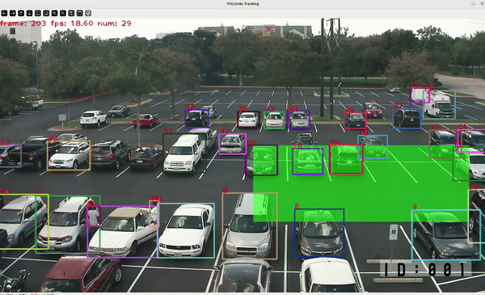

# Intrusion Detection

The **intrusion detection** example demonstrates real-time detection of intruding objects for any desired Region of Interest in a video feed. This can be very useful in video surveillance. ByteTrack has been used for tracking and Yolov8m has been used of the detection of objects

<p align="center">
  
</p>

## Overview

<div style="display: flex">
<div style="">

| **Property**         | **Details**
|----------------------|------------------------------------------
| **Models**           | [Yolov8m](https://docs.ultralytics.com/models/yolov8/), [ByteTrack](https://github.com/ifzhang/ByteTrack?tab=readme-ov-file)
| **Model Type**       | Object Detection, Tracking
| **Framework**        | [Tflite](https://www.tensorflow.org/)
| **Model Source**     | [Download from ultralytics](https://docs.ultralytics.com/models/yolov8/)
| **Pre-compiled DFP** | [Download here](https://developer.memryx.com/example_files/2p0/yolov8m_intrusion_detection.zip)
| **Input**            | 640x640x3
| **Output**           | Bounding boxes, confidence scores, Tracking Ids.
| **OS**               | Linux
| **License**          | [AGPL](LICENSE.md)

## Requirements

Before running the application, ensure that all **requirements** are installed.

```bash
pip3 install -r requirements.txt
```

## Running the Application

### Step 1: Download Pre-compiled DFP

To download and unzip the precompiled DFPs, use the following commands:
```bash
wget https://developer.memryx.com/example_files/2p0/yolov8m_intrusion_detection.zip
mkdir -p models
unzip yolov8m_intrusion_detection.zip -d models
```


### Step 2: Running the Script/Program

With the compiled model, you can now run real-time inference. Below are the examples of how to do this using Python.

#### Python

Use an input video file or a camera (by supplying `/dev/video0` as input) to run the intrusion detection example. Two suggested videos to use are linked below.

To run the example, execute the following commands:

```bash
cd src/python
python intrusion_demo.py --input_path [video file]
```


###  How the Logic Works
> **Logic Flow:**
> 1. **Start:** Video Feed Begins.
> 2.  **Grace Period:** System identifies existing objects (No Alarms).
> 3.  **Active Mode:** Grace period ends.
> 4.  **Monitoring:** System checks for new objects within the user-defined ROI.
> 5.  **Alert:** Object enters ROI → **ALARM ON**


## Third-Party Licenses

This project uses third-party software, models, and libraries. Below are the details of the licenses for these dependencies:

- **Model**: [YoloV8m Model from Ultralytics](https://docs.ultralytics.com/models/yolov8/) 🔗
  - License: [AGPL-3.0](https://github.com/ultralytics/ultralytics/tree/main?tab=AGPL-3.0-1-ov-file) 🔗

- **Code Reuse**: Some code components, including byte track, were sourced from [ByteTrack - github repository](https://github.com/ifzhang/ByteTrack?tab=readme-ov-file) 🔗
  - License: [MIT](https://github.com/ifzhang/ByteTrack?tab=readme-ov-file) 🔗


## Suggested Videos

- **Example Surveillance video 1**: [BLK-HDPTZ12 Security Camera](https://www.youtube.com/watch?v=U7HRKjlXK-Y) 🔗

- **Example Surveillance video 2**: Video of a Parking Lot, [Ion Alarm CCTV HD Parking Lot Camera](https://www.youtube.com/watch?v=ymuYdUT5p7Q) 🔗


## Summary

This guide offers a quick and easy way to intrusion detecion using the Object-Detection model on MemryX accelerators. You can use the Python implementation to perform real-time inference. Download the full code and the pre-compiled DFP file to get started immediately.
