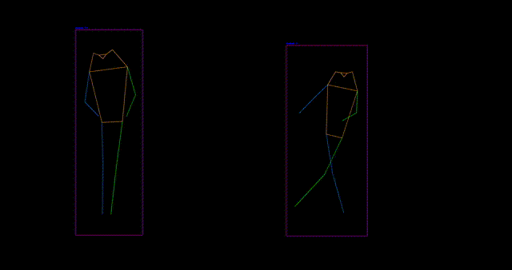

# Rtmpose Estimation 

The **RTMPose** example showcases real-time pose estimation with tracking using the pre-trained RTMPose model on MemryX accelerators. This guide provides setup instructions, model details, and essential code snippets to help you get started quickly.

<p align="center">
  
</p>

## Overview

| Property             | Details                                                                 |
|----------------------|-------------------------------------------------------------------------|
| **Model**            | [Yolox](https://github.com/open-mmlab/mmpose/tree/main/projects/rtmpose/yolox/humanart) 🔗  [Rtmpose](https://arxiv.org/pdf/1907.01341) 🔗
| **Model Type**       | Human detection & rtmpose  Estimation                                                        |
| **Framework**        | [onnx](https://onnx.ai/) 🔗
| **Model Source**     | [Yolox](https://download.openmmlab.com/mmpose/v1/projects/rtmposev1/onnx_sdk/yolox_tiny_8xb8-300e_humanart-6f3252f9.zip) 🔗   [Rtmpose](https://mmdeploy-oss.openmmlab.com/model/mmpose/rtmpose-s-d976b6.onnx) 🔗
| **Pre-compiled DFP** | [Download here](https://developer.memryx.com/example_files/2p0/yolox_rtmpose.zip)
| **Input**            | Input size for Yolox: (416,416,3), Input size for Rtmpose : (256,192,3)
| **Output**           | Keypoints
| **OS**               | Linux
| **License**          | [MIT](LICENSE.md)

## Requirements (Linux)

Before running the application, ensure that **OpenCV** are installed, especially for the Python implementation. You can install OpenCV using the following commands:

```bash
pip install opencv-python==4.11.0.86
pip install lap
```

## Running the Application (Linux)

### Step 1: Download Pre-compiled DFP

To download and unzip the precompiled DFPs, use the following commands:
```bash
wget https://developer.memryx.com/example_files/2p0/yolox_rtmpose.zip
mkdir -p models
unzip yolox_rtmpose.zip -d models
```

<details> 
<summary> (Optional) Download and compile the model yourself </summary>
If you prefer, you can download and compile the model rather than using the precompiled model. Download the pre-trained MiDaS v2 Small model from TensorFlow Hub:

```bash
mkdir -p models

wget https://download.openmmlab.com/mmpose/v1/projects/rtmposev1/onnx_sdk/yolox_tiny_8xb8-300e_humanart-6f3252f9.zip
unzip yolox_tiny_8xb8-300e_humanart-6f3252f9.zip
cp 20230928/yolox_onnx/yolox_tiny_8xb8-300e_humanart-6f3252f9/end2end.onnx  yolox.onnx
rm -r 20230928 yolox_tiny_8xb8-300e_humanart-6f3252f9.zip

wget https://mmdeploy-oss.openmmlab.com/model/mmpose/rtmpose-s-d976b6.onnx
mv rtmpose-s-d976b6.onnx  rtmpose-s.onnx
```

You can now use the MemryX Neural Compiler to compile the model and generate the DFP file required by the accelerator:

```bash
mx_nc -m models/yolox.onnx models/rtmpose-s.onnx  --extensions Rtmpose --autocrop --no_split_upsampling -c 4
```

</details>


### Step 2: Run the Script/Program

With the compiled model, you can now run real-time inference. Below are the examples of how to do this using Python.

#### Python

To run the Python example for real-time pose estimation using MX3, simply execute the following command:

```bash
python src/python/demo.py
```
You can specify video source with the following options:

* `--source`: Path to the input source file (default is /dev/video0)


For example, to run with a specific video source, use:

```bash
python src/python/demo.py --source <input_source> 
```
 

## Third-Party Licenses

This project uses third-party software, models, and libraries. Below are the details of the licenses for these dependencies:

- **Model**: [Yolox](https://github.com/open-mmlab/mmpose/tree/main/projects/rtmpose/yolox/humanart) 🔗 
            [Rtmpose](https://mmdeploy-oss.openmmlab.com/model/mmpose/rtmpose-s-d976b6.onnx) 🔗 
  - License: [Apache License 2.0](https://github.com/open-mmlab/mmpose/blob/main/LICENSE) 🔗

- **Code and Pre/Post-Processing**: Some code components, including pre/post-processing, were sourced from the rtmlib provided on [Github](https://github.com/Tau-J/rtmlib/tree/main)  
  - License: [Apache License 2.0](https://github.com/Tau-J/rtmlib/blob/main/LICENSE) 🔗

- **Preview**: ["Dance video" on Pexels](https://www.pexels.com/video/kids-break-dancing-7207384/)  
  - License: [Pexels License](https://www.pexels.com/license/)

## Summary

This guide offers a quick and easy way to run pose estimation using the Rtmpose model on MemryX accelerators. You can use Python implementation to perform real-time inference. Download the full code and the pre-compiled DFP file to get started immediately.
