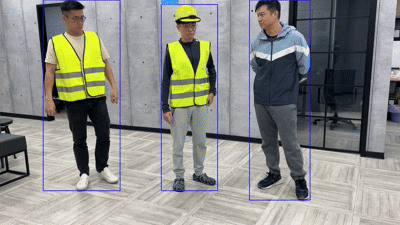

# People Tracking Using Yolo26

The **People Tracking** example demonstrates real-time people tracking on a single input stream using the pre-trained yolo26n model on MemryX accelerators. It uses [Kalman filters](https://www.mathworks.com/help/vision/ug/using-kalman-filter-for-object-tracking.html) to identify the "same" person across frames, and assigns unique IDs upon detecting a "new" person. This guide provides setup instructions, model details, and necessary code snippets to help you quickly get started.

<p align="center">
  
</p>

## Overview

| Property             | Details                                                                 |
|----------------------|-------------------------------------------------------------------------|
| **Model**            | [Yolo26n](https://docs.ultralytics.com/models/yolo26/)                   |
| **Model Type**       | Object Detection                                                        |
| **Framework**        | [ONNX](https://onnx.ai/)                                                |
| **Model Source**     | [Download from Ultralytics GitHub or docs](https://docs.ultralytics.com/tasks/detect/) |
| **Pre-compiled DFP** | [Download here](https://developer.memryx.com/model_explorer/2p2/YOLO26_nano_640_640_3_onnx.zip) |
| **Model Dataset**    | [COCO](https://docs.ultralytics.com/datasets/detect/coco/) |
| **Model Resolution** | 640x640                                                   |
| **Output**           | Bounding box coordinates & object probabilities            |
| **OS**           | Linux            |
| **License**          | [AGPL](LICENSE.md)                                            |

## Requirements

Before running the application, ensure that OpenCV Python is installed. You can install using the following command in your Python virtual env:

```bash
# For application
pip install opencv-python==4.11.0.86
```

If you want to export and compile the DFP yourself, also install yolo26 dependencies:

```bash
# For exporting the source yolov7 model to onnx
pip install seaborn pyyaml pandas
```

## Running the Application

### Step 1: Download Pre-compiled DFP

To download and unzip the precompiled DFPs, use the following commands:
```bash
wget https://developer.memryx.com/model_explorer/2p2/YOLO26_nano_640_640_3_onnx.zip
mkdir -p models
unzip YOLO26_nano_640_640_3_onnx -d models
```

<details> 
<summary> (Optional) Export and compile the model yourself </summary>

If you prefer, you can download and compile the model rather than using the precompiled model. 

Download the pretrained yolo26n.pt file from the Ultralytics documentation using the link below:

```bash
wget https://github.com/ultralytics/assets/releases/download/v8.4.0/yolo26n.pt 
```

You can use the following code to export the model to ONNX format:

```bash
from ultralytics import YOLO

# Load the model
model = YOLO("yolo26n.pt")  # load the downloaded model

# Export the model
model.export(format="onnx")
```
This script will generate a yolo26n.onnx file.

You can now use the MemryX Neural Compiler to compile the model and generate the DFP file required by the accelerator:

```bash
mv yolo26n.onnx YOLO26_nano_640_640_3_onnx.onnx
mx_nc -m YOLO26_nano_640_640_3_onnx.onnx -v --autocrop
```
The compiler will generate the DFP and a post-processing file which can be passed as inputs to the application.

</details>

### Step 2: Run the Program

To run the Python example for people tracking with yolo26n using MX3, simply execute the following command:

```bash
# ensure a camera device is connected, as the default video input is a cam
cd src/python
python run_yolo26n_singlestream_peopletracking.py 
```

You can specify the input video path with the following option:

* `--video_path` : Path to video file as inputs (default is /dev/video0, which is the first camera connected to the system)

For example, to run with a video file as input, run:

```bash
python run_yolo26n_singlestream_peopletracking.py --video_path ~/Videos/test_video.mp4
```

If no arguments are provided, the script will use the default (first camera).


## Third-Party Licences

This project uses third-party software and models. Below are the details of the licenses for these dependencies:

- **Model**:  [Yolo26n from Ultralytics GitHub](https://docs.ultralytics.com/models/yolo26/) 🔗 
  - License: [AGPLv3](https://github.com/ultralytics/ultralytics/blob/main/LICENSE)

