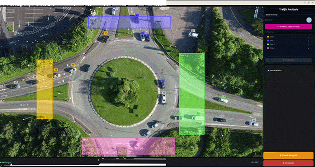

# YOLO OBB Object Detection

This example demonstrates **Object Detection** with *oriented boxes* using the
off-the-shelf YoloV8s-OBB model from Ultralytics compiled and running on the
MemryX accelerator. It implements an object detection pipeline for oriented
bounding boxes (OBB) where:

1. Objects are detected in an image.
2. Bounding boxes and keypoints are generated to represent detected objects.
3. The bounding boxes and keypoints are processed for further use in downstream tasks.

The implementation includes `MXObb`, which emulates a `Queue` structure, making
it easily integrable into a realtime application. The following demo code
utilizes `MXObb` to identify and count objects within an image.

<p align="center">
  
</p>

## Requirements

Before running the application, ensure that all **requirements** are installed.

```bash
pip install PyQt5
pip install opencv-python==4.11.0.86
```
## Overview

| Property             | Details                                                                                                                 |
|----------------------|-------------------------------------------------------------------------------------------------------------------------|
| **Model**            | [YoloV8s-OBB](https://github.com/ultralytics/ultralytics)                                                               |
| **Model Type**       | Object Detection (Oriented Bounding Boxes)                                                                              |
| **Framework**        | [Onnx](https://onnx.ai/)                                                                                                |
| **Model Source**     | [YoloV8s-OBB](https://github.com/ultralytics/ultralytics)                                                               |
| **Pre-compiled DFP** | [Download here](https://developer.memryx.com/model_explorer/2p0/YOLO_v8_small_Oriented_Bounding_Boxes_1024_1024_3_onnx.zip) |
| **Output**           | Object bounding box + keypoints                                                                                         |
| **OS**               | Linux                                                                                                                   |
| **License**          | [AGPL](LICENSE.md)                                                                                                      |


## Run the Application

### Step 1: Download Pre-compiled DFP

To download and unzip the precompiled DFPs, use the following commands:
```bash
mkdir models

wget https://developer.memryx.com/model_explorer/2p0/YOLO_v8_small_Oriented_Bounding_Boxes_1024_1024_3_onnx.zip
unzip YOLO_v8_small_Oriented_Bounding_Boxes_1024_1024_3_onnx.zip -d models
mv models/YOLO_v8_small_Oriented_Bounding_Boxes_1024_1024_3_onnx.dfp models/yolov8s-obb.dfp
mv models/YOLO_v8_small_Oriented_Bounding_Boxes_1024_1024_3_onnx_post.onnx models/yolov8s-obb_post.onnx

rm YOLO_v8_small_Oriented_Bounding_Boxes_1024_1024_3_onnx.zip
```

### Step 2: Run the Script

With the compiled model, you can now use the MXA to perform object detection. Run the following script to see object detection in action:

```bash
cd src/python
python main.py
```
You can specify the video path with the following options:

* `--video_path`: Path to the video file

## Third-Party Licenses

This project uses third-party software, models, and libraries. Below are the details of the licenses for these dependencies:

- **Original Idea**: [Traffic Analysis Example from Roboflow Supervision](https://github.com/roboflow/supervision/tree/develop/examples/traffic_analysis)  
  - License: [MIT License](https://github.com/roboflow/supervision/blob/develop/LICENSE.md) 🔗
- **Models**: [YoloV8s-OBB Model exported from the Ultralytics GitHub Repository](https://github.com/ultralytics/ultralytics)  
  - License: [GNU Affero General Public License v3.0](https://github.com/ultralytics/ultralytics/blob/main/LICENSE)
- **Default Video**: Default [Drone video](https://www.pexels.com/video/drone-footage-of-a-roundabout-8745399/) 🔗  
  - License: [Pexels License](https://www.pexels.com/license/) 🔗

## Summary

This example implements an Object Detection with oriented boxes, utilizing the
off-the-shelf YoloV8s-OBB model. It showcases how to detect, track and analyis traffic.